# Arquitectura objetivo

## Propósito

El Prompt Privacy System protege información sensible antes de que una interacción llegue a un modelo de lenguaje comercial. La protección no se limita a reemplazar texto: combina detección, clasificación, políticas configurables y operaciones de desidentificación dentro de una frontera controlada por el sistema.

Este documento define la arquitectura objetivo. La implementación puede avanzar de forma incremental, pero sus límites y responsabilidades deben converger hacia este diseño.

## Vista general

```mermaid
flowchart LR
    Persona([Persona usuaria])
    Extension[Extensión del navegador]
    Middleware[Middleware de privacidad]
    Inferencia[Servicio de inferencia]
    Administracion[Aplicación administrativa]
    LLM([Modelo de lenguaje comercial])

    Persona --> Extension
    Extension <--> Middleware
    Middleware <--> Inferencia
    Administracion <--> Middleware
    Extension --> LLM
```

La extensión intercepta la interacción y coordina la revisión en el navegador. El middleware, expuesto como un backend FastAPI, concentra las decisiones de detección y protección. El servicio de inferencia, construido con BentoML, ejecuta modelos de aprendizaje automático sin conocer las políticas del sistema. La aplicación administrativa configura el comportamiento que el middleware aplica después.

## Límites principales

- El texto protegido se envía al modelo de lenguaje comercial desde la extensión; el middleware no actúa como proxy del proveedor externo.
- La detección basada en patrones, diccionarios y fusión pertenece al middleware.
- El servicio de inferencia contiene únicamente modelos de aprendizaje automático y conserva la taxonomía nativa de cada modelo.
- La taxonomía canónica pertenece al sistema, es versionada y no puede modificarse mediante administración.
- La administración cambia configuración operativa, pero no participa en el procesamiento de una interacción.
- Detectar una entidad y decidir cómo protegerla son responsabilidades separadas.

## Flujo principal

1. La extensión obtiene el texto del prompt y de los adjuntos compatibles.
2. El middleware ejecuta los mecanismos de detección habilitados.
3. Las detecciones se normalizan hacia la taxonomía canónica y se fusionan.
4. Las reglas de protección determinan el tratamiento de cada entidad.
5. El motor de desidentificación aplica las operaciones decididas.
6. La extensión presenta la revisión necesaria y envía el texto protegido al modelo comercial.

## Documentación por módulo

### Backend

- [`privacy-middleware/`](backend/privacy-middleware/README.md): orquestación de detección, políticas y desidentificación.
- [`inference-service/`](backend/inference-service/README.md): descubrimiento y ejecución de modelos de detección.

### Frontend

- [`browser-extension/`](frontend/browser-extension/README.md): interceptación y coordinación de la interacción en el navegador.
- [`administration/`](frontend/administration/README.md): experiencia para administrar la configuración del sistema.
