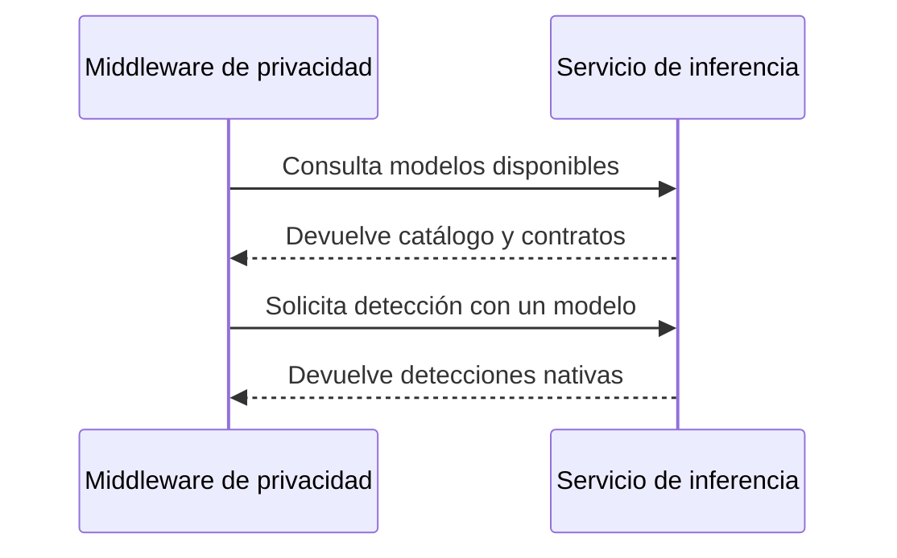

# Servicio de inferencia

## Propósito técnico

El servicio de inferencia ofrece mediante BentoML modelos de aprendizaje automático para detectar información sensible. Se mantiene separado del middleware para que los modelos puedan evolucionar y desplegarse sin trasladar al entorno de inferencia las políticas de privacidad del sistema.

## Límites

El módulo declara los modelos disponibles, describe sus contratos y ejecuta el modelo solicitado sobre un texto.

Quedan fuera de sus límites la selección administrativa del modelo activo, el mapeo hacia la taxonomía canónica, la detección basada en patrones o diccionarios, la fusión, las reglas de protección y la transformación del texto.

## Capacidades principales

- Servir varios modelos de detección con identidades y versiones explícitas.
- Informar qué modelos están disponibles.
- Declarar la versión y las categorías nativas producidas por cada modelo.
- Permitir que el modelo se seleccione en cada solicitud válida.
- Devolver detecciones con fragmentos, límites, categoría nativa y confianza.

## Relación con el middleware

El middleware conserva la configuración que selecciona un modelo y traduce sus categorías. Esta frontera evita que el servicio de inferencia dependa de políticas, diccionarios o taxonomías internas del sistema.

## Restricciones

- Cada resultado identifica el modelo y la versión utilizados.
- Las categorías declaradas en el catálogo coinciden con las que el modelo puede devolver.
- Un modelo no disponible produce un error explícito y no activa una sustitución silenciosa.
- El servicio no conserva decisiones de protección entre solicitudes.
- Incorporar un modelo nuevo es una operación de infraestructura, no una acción administrativa ordinaria.

## Documentación relacionada

- [`Taxonomía canónica`](../privacy-middleware/data/taxonomia-canonica.md): explica por qué las categorías nativas se adaptan fuera del servicio.
- [`Detección híbrida`](../privacy-middleware/capabilities/deteccion-hibrida.md): describe cómo sus resultados participan en la detección completa.
- [`Separación entre privacidad e inferencia`](../privacy-middleware/decisions/separacion-de-inferencia.md): registra el motivo y las consecuencias de esta frontera.
