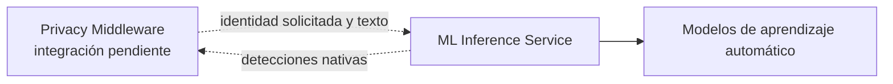
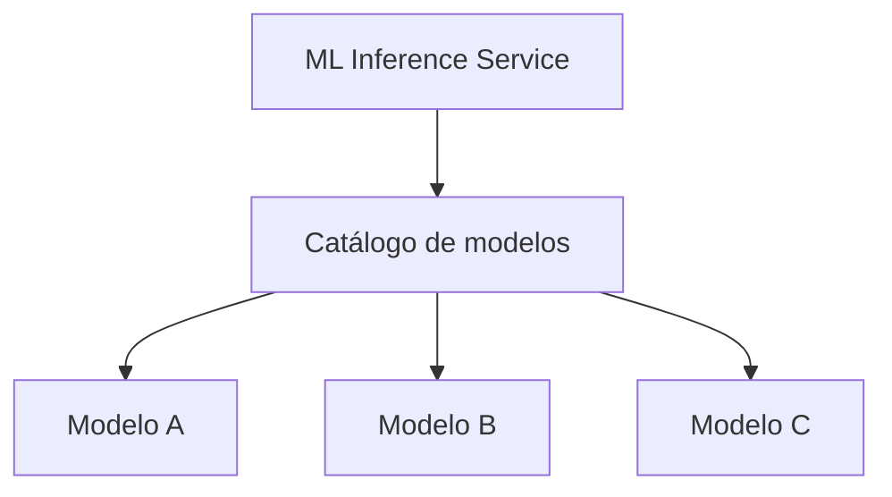

# ML Inference Service

## Propósito técnico

El ML Inference Service aloja modelos de aprendizaje automático, declara cuáles puede ejecutar y produce sus detecciones nativas. Su frontera permite que los modelos evolucionen sin incorporar las decisiones de privacidad que corresponden al resto del sistema.

El servicio representa una capacidad multimodelo aunque la instancia actual tenga un único modelo real habilitado. La capacidad arquitectónica y la cantidad de modelos desplegados son conceptos distintos.

## Frontera del servicio

El ML Inference Service termina cuando entrega detecciones con la semántica nativa del modelo. La interpretación canónica, la combinación con otras fuentes y la protección del texto pertenecen al Privacy Middleware.

| Dentro del ML Inference Service | Fuera del ML Inference Service |
|---|---|
| Alojar modelos habilitados | Definir la taxonomía canónica |
| Descubrir modelos y capacidades | Mapear categorías nativas |
| Resolver el modelo solicitado | Ejecutar Pattern Recognizers o Gazetteers |
| Ejecutar inferencia ML | Fusionar o priorizar detecciones |
| Adaptar técnicamente la salida del modelo | Aplicar políticas de protección |
| Devolver detecciones nativas | Seudonimizar o transformar el texto |
| Reutilizar modelos ya inicializados | Administrar cuál modelo debe usar el sistema |

Esta separación evita que cambios en taxonomías, políticas o mecanismos de protección obliguen a modificar o desplegar nuevamente cada modelo. También impide que decisiones globales de privacidad queden ocultas dentro del entorno de inferencia.

## Arquitectura lógica multimodelo

Todos los modelos atraviesan una frontera común de identidad, metadata e inferencia. El catálogo mantiene el conjunto ejecutable por una instancia y permite que el servicio trabaje con modelos distintos sin conocer sus detalles internos.

## Capacidades principales

- Descubrir modelos disponibles y sus capacidades nativas.
- Seleccionar explícitamente un modelo mediante su identidad lógica.
- Ejecutar únicamente el modelo solicitado.
- Informar qué modelo y versión produjeron cada resultado.
- Conservar categorías, fragmentos, posiciones, confianza y solapamientos nativos.
- Reutilizar modelos costosos entre solicitudes.
- Rechazar identidades desconocidas sin elegir un modelo alternativo.

## Estado de materialización

El servicio de inferencia materializa actualmente discovery, selección explícita, inferencia nativa y reutilización de modelos. La instancia actual registra un único modelo real, pero el contrato y el catálogo admiten varias implementaciones.

La adaptación hacia la taxonomía canónica y la fusión están asignadas al Privacy Middleware. El estado de esa integración se detalla en la decisión de [`separación entre privacidad e inferencia`](../privacy-middleware/decisions/separacion-de-inferencia.md).

## Documentación

### Capacidades

- [`Catálogo, discovery y selección`](capabilities/catalogo-y-seleccion.md): contrato común, metadata, catálogo, descubrimiento y resolución explícita.

### Flujos

- [`Inferencia y detecciones nativas`](flows/inferencia-nativa.md): recorrido de una solicitud, adaptación técnica, detecciones y frontera semántica.

### Decisiones

- [`Identidad y ciclo de vida de modelos`](decisions/identidad-y-ciclo-de-vida.md): identidad lógica, artefactos, reutilización y preguntas operacionales abiertas.
- [`Separación entre privacidad e inferencia`](../privacy-middleware/decisions/separacion-de-inferencia.md): motivo y consecuencias de la frontera con el Privacy Middleware.

### Relación con el Privacy Middleware

- [`Taxonomía canónica`](../privacy-middleware/data/taxonomia-canonica.md): contrato semántico que recibe posteriormente las categorías adaptadas.
- [`Detección híbrida`](../privacy-middleware/capabilities/deteccion-hibrida.md): arquitectura objetivo para combinar modelos con otras fuentes de detección.
