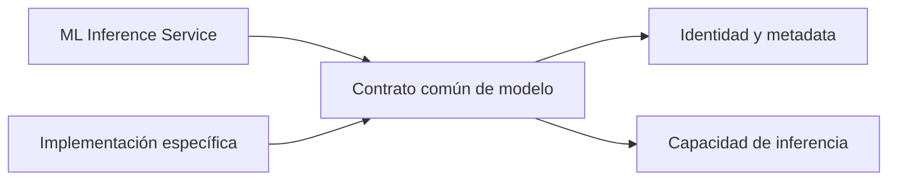
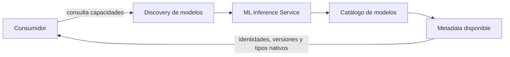

# Catálogo, discovery y selección de modelos

## Propósito

El ML Inference Service permite conocer qué modelos puede ejecutar una instancia y seleccionar uno de forma inequívoca. Esta capacidad evita que un consumidor dependa de repositorios, frameworks o detalles de carga específicos de cada modelo.

## Contrato común de modelo

Todo modelo disponible presenta la misma frontera conceptual:

Las diferencias internas se adaptan antes de atravesar esta frontera. El resto del servicio no necesita conocer:

- el framework utilizado por el modelo;
- el formato crudo de salida;
- el repositorio o proveedor del artefacto;
- el tokenizer utilizado;
- el mecanismo concreto de carga.

## Metadata del modelo

La metadata describe el contrato público y las capacidades declaradas de un modelo.

| Información | Propósito |
|---|---|
| Identidad lógica | Permite discovery, selección y correlación de resultados. |
| Nombre legible | Facilita que personas y sistemas reconozcan el modelo. |
| Versión | Identifica la versión que produce una inferencia. |
| Descripción o propósito | Explica para qué tipo de detección existe el modelo. |
| Tipos de entidad nativos | Declara las categorías que el modelo puede producir. |

Los tipos declarados son **categorías nativas del modelo**. No pertenecen todavía a la taxonomía canónica del Privacy Middleware y no expresan por sí solos una política de protección.

La metadata debe ser coherente con la salida observable del modelo. Publicar categorías que el modelo no puede producir, u omitir categorías que sí expone, rompería el contrato de discovery.

## Catálogo de modelos

El catálogo representa los modelos habilitados y ejecutables por una instancia concreta del servicio.

Sus responsabilidades son:

- conocer los modelos habilitados;
- garantizar que cada identidad lógica sea inequívoca dentro de la instancia;
- listar la metadata disponible;
- resolver un modelo mediante su identidad lógica;
- conservar las instancias inicializadas para su reutilización.

El catálogo no es:

- una base de datos;
- un repositorio de dominio;
- una interfaz de administración;
- un model registry empresarial;
- un gestor de plugins dinámicos;
- una política para elegir qué modelo conviene ejecutar.

La presencia de un modelo en el catálogo significa que esa instancia puede ejecutarlo. Desplegar, retirar o asignar modelos al catálogo sigue siendo una responsabilidad operacional.

## Discovery de modelos

Discovery responde a la pregunta: **¿qué modelos puede ejecutar actualmente esta instancia?**

El consumidor puede validar su configuración y conocer capacidades sin codificar conocimiento sobre implementaciones concretas. Discovery informa el estado ejecutable de la instancia; no descubre artefactos arbitrarios ni incorpora modelos dinámicamente.

## Selección explícita

Cada operación de inferencia incluye la identidad lógica del modelo que desea ejecutar.

No existe un modelo global implícito ni una selección silenciosa dentro del servicio. La respuesta identifica la identidad y versión realmente ejecutadas para que el consumidor pueda interpretar y auditar el resultado.

## Modelo desconocido

Una identidad ausente del catálogo produce un fallo explícito y no ejecuta ningún otro modelo.

Un fallback silencioso sería peligroso porque dos modelos pueden declarar categorías, granularidades y comportamiento distintos. Sustituir uno por otro sin informar al consumidor cambiaría la semántica de detección y podría provocar que se aplique un mapeo canónico incorrecto.

La frontera de transporte representa este fallo como un recurso no disponible. La decisión arquitectónica importante es la ausencia de fallback, no el código concreto utilizado por un protocolo.

## Invariantes

- Las identidades son únicas dentro de cada catálogo.
- Discovery y selección utilizan la misma identidad lógica.
- Una inferencia ejecuta exactamente un modelo solicitado.
- La respuesta identifica el modelo y la versión ejecutados.
- Una identidad desconocida no activa otro modelo.
- El catálogo no decide cuál modelo debe configurar el Privacy Middleware.
