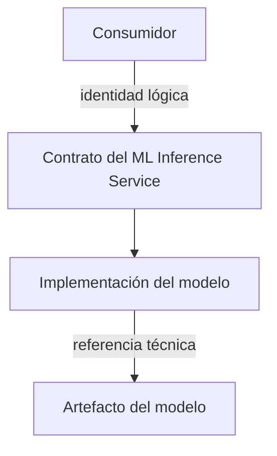
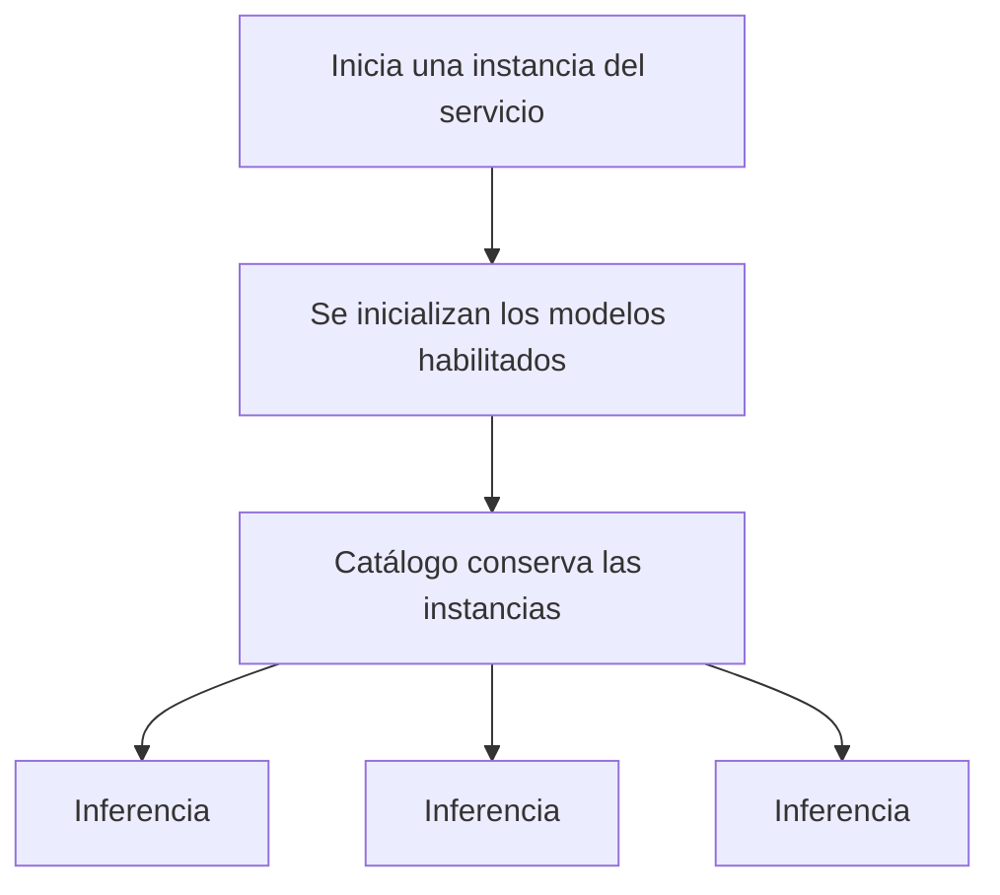

# Identidad y ciclo de vida de modelos

## Decisión arquitectónica

Los modelos se seleccionan mediante una identidad lógica estable y se reutilizan como recursos costosos durante la vida de una instancia del servicio. La identidad pública no expone la referencia física del artefacto ni su proveedor.

Esta decisión mantiene estable el contrato del servicio aunque cambien el almacenamiento, el framework o el mecanismo de carga del modelo.

## Identidad lógica y artefacto

| Identidad lógica | Referencia del artefacto |
|---|---|
| Pertenece al contrato público del servicio. | Pertenece a la implementación concreta. |
| Se usa para discovery y selección. | Se usa para localizar y cargar pesos o recursos. |
| Debe permanecer estable para los consumidores. | Puede cambiar por infraestructura o proveedor. |
| Aparece en el resultado de inferencia. | No constituye la identidad pública del modelo. |

Una versión forma parte de la metadata y del resultado ejecutado. La selección actual se realiza mediante identidad lógica, no mediante una referencia de artefacto.

## Ciclo de vida conceptual

Los modelos son recursos costosos en memoria y tiempo de inicialización. El servicio no sigue el patrón cargar, inferir y descartar en cada solicitud. El catálogo conserva las instancias disponibles para atender múltiples inferencias.

## Implementación actual

BentoML materializa la frontera de servicio. Cada worker inicializa los modelos registrados al comenzar y mantiene su propio catálogo durante su vida. Por lo tanto, el número de workers influye en la cantidad de copias residentes y en el consumo de memoria.

La instancia actual inicializa todos sus modelos registrados y cuenta con un único modelo real. Este mecanismo confirma la reutilización por worker, pero no establece por sí mismo la estrategia operacional definitiva para una flota con muchos modelos.

## Consecuencias

- Los consumidores no dependen de repositorios o proveedores de modelos.
- Cambiar una referencia técnica no exige necesariamente cambiar la identidad pública.
- La respuesta puede correlacionarse con la identidad y versión ejecutadas.
- El costo de carga se paga al inicializar el worker, no en cada inferencia.
- Cada modelo adicional puede aumentar el tiempo de arranque y la memoria residente de cada worker.
- Retirar o incorporar modelos requiere cambiar el conjunto operacional de la instancia; no es una acción administrativa ordinaria.

## Decisiones abiertas

### Estrategia física multimodelo

La capacidad lógica multimodelo no determina todavía cómo debe desplegarse una cantidad mayor de modelos. Sigue abierta la elección entre:

- varios modelos residentes en una misma instancia;
- instancias especializadas por modelo;
- carga bajo demanda;
- otra estrategia operacional basada en memoria, latencia y escalado.

La implementación actual carga los modelos registrados por worker, pero no se adopta como decisión irreversible para futuros despliegues.

### Coexistencia de versiones

El catálogo actual garantiza una única entrada por identidad lógica y la inferencia selecciona por esa identidad. La versión se informa como metadata y en el resultado, pero no participa en la selección.

Todavía debe decidirse cómo coexistirían varias versiones ejecutables del mismo modelo lógico:

- una única versión activa por identidad;
- selección mediante identidad y versión;
- identidades públicas versionadas;
- otra regla explícita de compatibilidad.

Hasta que exista esa decisión, no debe asumirse que dos versiones pueden convivir bajo la misma identidad en una instancia.
