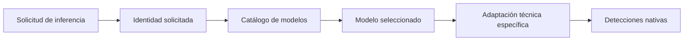
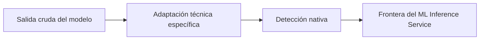
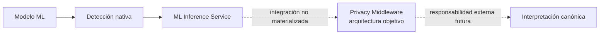

# Inferencia y detecciones nativas

## Propósito

La inferencia transforma la salida técnica de un modelo en detecciones nativas estables, sin reinterpretarlas mediante la taxonomía o las políticas globales del sistema.

## Flujo de inferencia



El catálogo resuelve la identidad solicitada y entrega el modelo correspondiente. El modelo analiza el texto y adapta su formato crudo a la frontera común. El resultado conserva la identidad y versión ejecutadas junto con todas las detecciones válidas producidas.

## Contrato de detección

Una detección nativa contiene, como mínimo:

| Información | Significado |
|---|---|
| Tipo de entidad nativo | Categoría asignada por el propio modelo. |
| Fragmento detectado | Texto comprendido por la detección. |
| Inicio | Posición inicial dentro del texto analizado. |
| Fin | Posición final exclusiva dentro del texto analizado. |
| Confianza | Valor de confianza informado por el modelo. |

**Nativo** significa que la semántica procede del modelo antes de cualquier adaptación hacia la taxonomía canónica del Privacy Middleware.

## Adaptación técnica

Cada implementación puede necesitar transformar detalles técnicos de su salida para cumplir el contrato común.



Son adaptaciones válidas, por ejemplo, interpretar posiciones, convertir una confianza a su representación contractual o retirar marcadores técnicos de segmentación. Estas transformaciones no pueden cambiar una categoría nativa por una categoría canónica ni introducir detecciones provenientes de reglas externas al modelo.

## Solapamientos y ausencia de fusión

El servicio conserva detecciones válidas aunque sus fragmentos se superpongan.

```text
Detección A  ─────────
Detección B      ─────────
```

Decidir cuál prevalece, si deben combinarse o si representan conceptos compatibles requiere información sobre taxonomía, fuentes y políticas globales. Esa decisión pertenece a la fusión del Privacy Middleware.

Eliminar solapamientos dentro del ML Inference Service ocultaría una decisión de privacidad y podría descartar evidencia que otros mecanismos necesitan para construir el resultado final.

## Frontera semántica



El ML Inference Service entrega evidencia nativa. La arquitectura asigna al Privacy Middleware el mapping canónico, la combinación con Pattern Recognizers y Gazetteers, la fusión y las decisiones de protección. La integración que materializa esa etapa posterior todavía está pendiente.

## Invariantes

- El texto de la detección corresponde al fragmento delimitado por sus posiciones.
- La confianza permanece dentro del rango contractual.
- La categoría conserva la semántica nativa del modelo.
- La respuesta conserva todos los solapamientos válidos.
- La inferencia no agrega detecciones basadas en patrones, diccionarios o políticas.
- El servicio no modifica el texto analizado.
