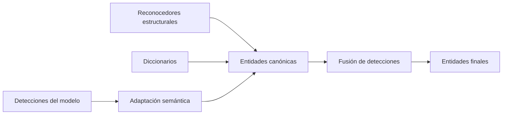

# Detección híbrida

## Propósito

La detección híbrida combina técnicas con fortalezas diferentes para localizar información sensible. Su resultado es un conjunto ordenado y coherente de fragmentos de texto clasificados con la taxonomía canónica.

## Fuentes de detección

### Modelos de aprendizaje automático

El adaptador de inferencia solicita detecciones al modelo seleccionado. Cada respuesta utiliza la taxonomía nativa del modelo y se traduce mediante un mapeo administrable antes de participar en la fusión.

El adaptador conoce el modelo seleccionado y el mapeo vigente. El servicio de inferencia no conoce estas decisiones del middleware.

### Reconocedores estructurales

Los reconocedores detectan datos con una estructura verificable, como correos, teléfonos, identificadores nacionales o claves. Un reconocedor puede combinar:

- un patrón de candidatos;
- validadores o invalidadores;
- palabras de contexto;
- un tipo de entidad canónico;
- una confianza base;
- un estado habilitado o deshabilitado.

Un patrón aislado no constituye necesariamente un reconocedor completo. La validación y el contexto permiten reducir falsos positivos y expresar reglas propias del dominio.

### Diccionarios

Los diccionarios buscan coincidencias en colecciones administradas, como instituciones, carreras, proyectos o personas internas. Cada colección se asocia a un tipo de entidad canónico.

Los diccionarios son recursos distintos de los reconocedores estructurales: almacenan entradas concretas y requieren un ciclo de administración independiente.

## Normalización y fusión

La fusión recibe únicamente entidades expresadas con la taxonomía canónica. Sus responsabilidades son:

- descartar detecciones que no alcancen el umbral configurado;
- ordenar y normalizar límites de texto;
- identificar detecciones duplicadas o solapadas;
- aplicar la prioridad configurada entre fuentes;
- conservar la categoría más específica cuando dos detecciones compatibles representan el mismo fragmento;
- producir un conjunto final sin ambigüedades operativas.

## Datos relevantes

Cada detección debe conservar, como mínimo, el fragmento localizado, sus límites, la categoría, la confianza y la fuente. Las detecciones de modelos mantienen además la referencia necesaria para interpretar el mapeo aplicado.

## Límites y restricciones

- Ninguna detección con una categoría nativa de un modelo entra directamente a la fusión.
- Los reconocedores y diccionarios producen categorías existentes en la taxonomía canónica.
- La fusión determina qué entidades son coherentes, pero no decide cómo protegerlas.
- Una entidad que no pueda mapearse no se descarta silenciosamente; se trata como una brecha de taxonomía observable.
- Una brecha de mapeo conserva el modelo, versión, categoría nativa, confianza y límites originales. Su fragmento se protege de forma conservadora cuando no queda cubierto por otra entidad final.
- La prioridad entre fuentes y los umbrales son configuración, no reglas embebidas en cada detector.
