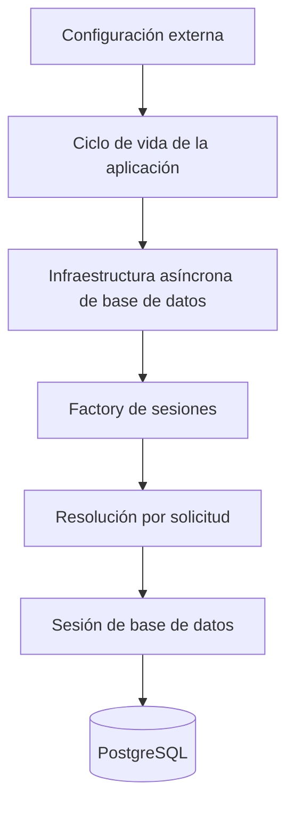
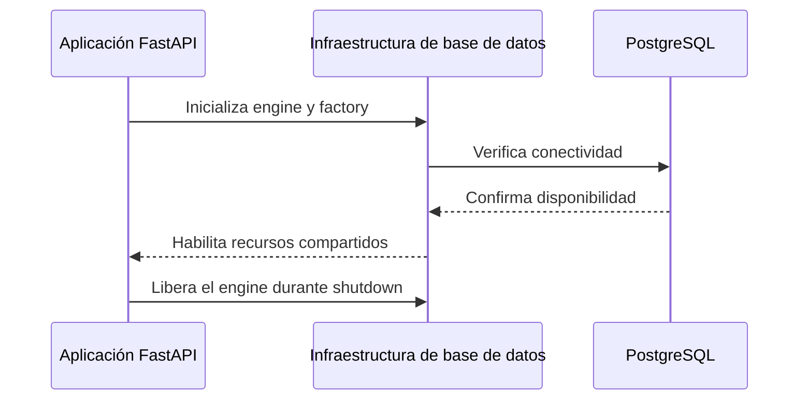

# Infraestructura de persistencia

## Propósito

El Privacy Middleware mantiene una única infraestructura asíncrona de conexión a PostgreSQL por instancia de aplicación. Allí conserva la configuración administrable que gobierna detección y protección sin compartir sesiones entre solicitudes.

## Flujo

La configuración se valida antes de construir la infraestructura. Durante startup se crea el engine, se asocia una factory de sesiones y se ejecuta una consulta mínima independiente del schema. La API solo comienza a recibir solicitudes cuando PostgreSQL responde.

## Scopes

| Recurso | Scope | Motivo |
|---|---|---|
| Engine y pool | Aplicación | Son costosos y seguros para reutilizar entre solicitudes. |
| Factory de sesiones | Aplicación | Produce sesiones nuevas sobre el engine compartido. |
| Sesión | Solicitud | Conserva estado de una operación y debe cerrarse al finalizarla. |
| Repositorio de configuración | Solicitud | Queda ligado a la sesión usada por la operación administrativa o de protección. |

La factory compartida no equivale a una sesión compartida. Cada solicitud que necesita persistencia recibe una sesión propia mediante una dependency con cleanup garantizado.

## Ciclo de vida

Una base inaccesible impide completar el startup. No se implementan reintentos, modo degradado ni pooling adicional sobre el que ya proporciona SQLAlchemy.

## Implementación actual

SQLAlchemy 2.0 administra el engine, el pool y las sesiones mediante su API asíncrona. Psycopg 3 proporciona el dialecto PostgreSQL. Las credenciales se entregan como configuración externa y la URL se construye de forma tipada para representar contraseñas con caracteres especiales sin concatenación manual.

El recurso compartido se construye dentro del lifespan de FastAPI y la factory queda disponible en el container de aplicación. Las dependencies de la frontera FastAPI crean y cierran cada sesión; el container nunca almacena la sesión actual.

Las migraciones versionadas crean y evolucionan la configuración persistente. La configuración inicial de desarrollo queda almacenada como datos reales y puede modificarse posteriormente por la API administrativa. El arranque de la aplicación no crea tablas automáticamente.

La persistencia contiene únicamente el modelo activo, mappings, reconocedores estructurales, gazetteers y sus entradas, settings de detección y reglas de protección. La taxonomía canónica permanece en el sistema y no es editable.

En Windows, el runtime utiliza un event loop basado en selector porque Psycopg 3 async no es compatible con el loop Proactor predeterminado. Esta adaptación pertenece a la composición de la aplicación y no altera los contratos internos.

## Límites

- La dependency administra apertura y cierre, pero no hace commit automático.
- Las operaciones administrativas confirman sus cambios de forma explícita; las lecturas del pipeline no abren una transacción de escritura intencional.
- No se utiliza un repository genérico: el contrato expone únicamente las operaciones requeridas por configuración y protección.
- El endpoint general de health no consulta PostgreSQL en cada solicitud.
