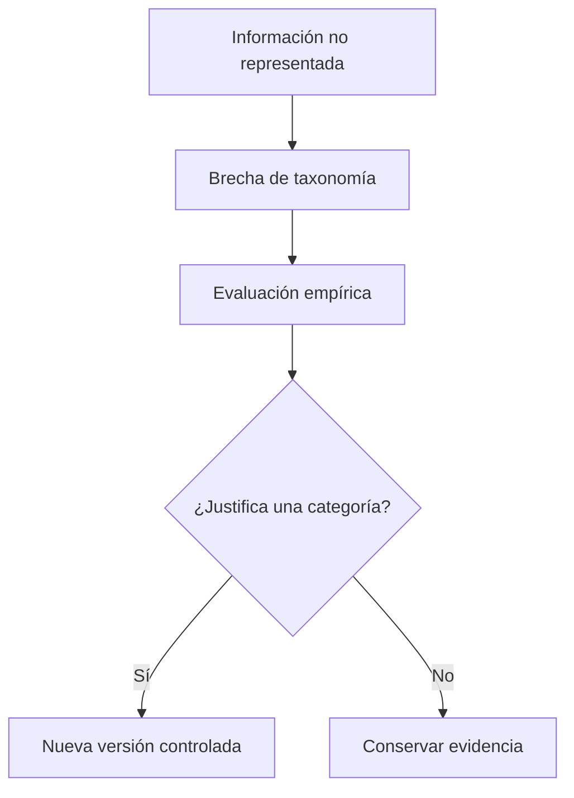

# Taxonomía canónica de información sensible

## Propósito

La taxonomía canónica es el contrato semántico común entre detección, fusión, reglas de protección y desidentificación. Define cómo clasifica el sistema la información sensible en el contexto universitario, con independencia de las categorías utilizadas por cada modelo.

La primera definición objetivo se denomina **University PII Taxonomy v1**.

## Principios

- Es jerárquica: una entidad puede expresarse en una categoría general o en una categoría más específica.
- No es administrable: su estructura cambia mediante una evolución controlada del sistema.
- Es versionada: cada definición publicada conserva una identidad explícita.
- Evita categorías heterogéneas como `OTHER` o `MISC`.
- Separa la categoría semántica de propiedades adicionales como alcance y tipo de identificador.
- Permite que detectores con distinta granularidad produzcan resultados compatibles.

## Estructura semántica

```text
PII
├── PERSON
│   └── PERSON_NAME
├── CONTACT
│   ├── EMAIL
│   └── PHONE
├── DIGITAL_IDENTITY
│   ├── USERNAME
│   └── PERSONAL_URL
├── IDENTIFIER
│   ├── NATIONAL_ID
│   └── STUDENT_ID
├── GEOGRAPHIC
│   ├── STREET_ADDRESS
│   ├── LOCATION
│   └── NATIONALITY
├── DEMOGRAPHIC
│   └── AGE
├── TEMPORAL
│   └── DATE
└── AFFILIATION
    ├── EDUCATIONAL_AFFILIATION
    └── EMPLOYMENT_AFFILIATION
```

Las categorías generales y específicas forman parte de la misma taxonomía. Un detector puede producir `IDENTIFIER` cuando no dispone de evidencia para elegir una subcategoría, mientras otro puede producir `NATIONAL_ID` para el mismo fragmento cuando valida su formato.

## Definiciones

| Categoría | Significado |
|---|---|
| `PERSON_NAME` | Nombre propio de una persona, sin distinguir su rol contextual. |
| `EMAIL` | Dirección de correo asociada a una persona. |
| `PHONE` | Número telefónico asociado a una persona. |
| `USERNAME` | Identificador de una persona dentro de un servicio digital. |
| `PERSONAL_URL` | Dirección que contiene o conduce a información identificadora de una persona. |
| `NATIONAL_ID` | Identificador oficial emitido por una autoridad estatal. |
| `STUDENT_ID` | Identificador asignado por una institución educativa. |
| `STREET_ADDRESS` | Dirección física suficientemente específica para localizar un lugar asociado a una persona. |
| `LOCATION` | Lugar geográfico mencionado en relación con una persona. |
| `NATIONALITY` | Nacionalidad o procedencia nacional atribuida a una persona. |
| `AGE` | Edad de una persona. |
| `DATE` | Fecha relacionada con una persona o un acontecimiento personal. |
| `EDUCATIONAL_AFFILIATION` | Relación de una persona con una institución educativa. |
| `EMPLOYMENT_AFFILIATION` | Relación de una persona con una organización laboral. |

Detectar una categoría no obliga a protegerla. La taxonomía describe qué información aparece; las reglas de protección deciden el tratamiento según el contexto y la política vigente.

## Dimensión de alcance

El alcance indica dónde suele resultar relevante una categoría. No forma parte de la jerarquía semántica y no determina por sí solo si la entidad debe protegerse.

| Alcance | Significado | Categorías iniciales |
|---|---|---|
| `CORE` | Aplicación transversal. | `PERSON_NAME`, `EMAIL`, `PHONE`, `USERNAME`, `PERSONAL_URL`, `STREET_ADDRESS`, `NATIONAL_ID` |
| `DOMAIN_SPECIFIC` | Relevancia particular para el dominio universitario. | `STUDENT_ID`, `EDUCATIONAL_AFFILIATION` |
| `CONTEXT_DEPENDENT` | Sensibilidad dependiente de la interacción. | `AGE`, `DATE`, `LOCATION`, `NATIONALITY`, `EMPLOYMENT_AFFILIATION` |

## Dimensión de identificabilidad

Esta dimensión expresa el comportamiento general de una categoría respecto de la reidentificación. No sustituye una futura evaluación contextual del riesgo.

| Tipo | Significado | Categorías iniciales |
|---|---|---|
| `DIRECT` | Puede identificar por sí sola a una persona. | `PERSON_NAME`, `EMAIL`, `PHONE`, `USERNAME`, `PERSONAL_URL`, `STREET_ADDRESS`, `NATIONAL_ID`, `STUDENT_ID` |
| `INDIRECT` | Puede contribuir a identificar al combinarse con otros datos. | `AGE`, `DATE`, `LOCATION`, `NATIONALITY`, `EDUCATIONAL_AFFILIATION`, `EMPLOYMENT_AFFILIATION` |

## Uso por responsabilidad

### Servicio de inferencia

Cada modelo conserva su taxonomía nativa. El servicio declara qué categorías puede producir, pero no conoce la taxonomía canónica.

### Adaptación de inferencia

El middleware traduce cada categoría nativa hacia una categoría general o específica de la taxonomía canónica mediante el mapeo vigente.

### Reconocedores y diccionarios

Los reconocedores estructurales producen categorías canónicas directamente. Cada diccionario se asocia a una categoría canónica existente.

### Fusión

La fusión utiliza las relaciones padre-hijo para reconocer detecciones semánticamente compatibles. Cuando existe evidencia suficiente sobre el mismo fragmento, puede conservar la categoría más específica.

### Reglas de protección

Una regla definida sobre una categoría general actúa como valor predeterminado para sus descendientes. Una regla definida sobre una categoría específica tiene prioridad.

### Desidentificación

La categoría orienta la selección de operaciones y permite generar sustitutos semánticamente compatibles. Si solo se conoce una categoría general, el sistema utiliza una estrategia compatible con ese nivel de precisión.

## Brechas y evolución

La información potencialmente sensible que no pueda representarse se registra como una **brecha de taxonomía**. Una brecha no es una categoría canónica y no debe provocar que la detección se descarte silenciosamente.



Una categoría nueva requiere evidencia de que representa un concepto diferente, aparece con relevancia en el dominio, aporta valor operativo y no fragmenta innecesariamente la clasificación.

## Invariantes

- La administración no modifica la estructura de la taxonomía.
- Todo recurso configurable referencia categorías de una versión conocida.
- Los cambios estructurales producen una nueva versión y revisan mapeos, reglas y estrategias afectadas.
- Las categorías desconocidas o sin mapeo permanecen observables.
- La taxonomía clasifica información; no reemplaza las decisiones contextuales de protección.
