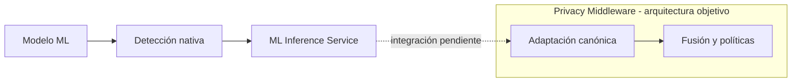

# Separación entre privacidad e inferencia

## Decisión

El Privacy Middleware es dueño de la detección basada en patrones y diccionarios, la adaptación semántica, la fusión, las políticas y la desidentificación. El ML Inference Service se limita a alojar, descubrir y ejecutar modelos de aprendizaje automático, y devuelve sus detecciones nativas.

## Motivo

Los modelos y las políticas evolucionan por razones diferentes. Los modelos requieren un entorno especializado de inferencia, mientras que los reconocedores, la taxonomía, las reglas y las operaciones de protección forman parte del comportamiento estable del sistema.

Separar ambos límites evita que un modelo tenga que conocer la taxonomía canónica o la configuración administrativa. También permite sustituir o versionar modelos sin trasladar la lógica de privacidad a cada despliegue de inferencia.

## Consecuencias

- Cada modelo declara su propia taxonomía y el middleware mantiene el mapeo canónico.
- La solicitud de inferencia identifica explícitamente el modelo que debe ejecutarse.
- El servicio de inferencia ofrece descubrimiento de modelos, versiones y categorías nativas.
- El servicio conserva detecciones solapadas; el middleware decide posteriormente cómo fusionarlas.
- Los detectores no basados en aprendizaje automático permanecen disponibles aunque cambie el modelo seleccionado.
- La comunicación entre ambos servicios añade una frontera remota que requiere errores explícitos, contratos versionados y observabilidad.

## Estado de materialización

El ML Inference Service materializa actualmente el catálogo, discovery, selección explícita, inferencia nativa y reutilización de modelos sobre BentoML.

La API FastAPI del Privacy Middleware todavía no materializa el consumo remoto, el mapping canónico ni la fusión. Esas responsabilidades forman parte de la arquitectura objetivo del middleware y no deben trasladarse temporalmente al servicio de inferencia.

## Restricciones

- BentoML no selecciona el modelo activo a partir de configuración administrativa.
- BentoML no fusiona detecciones ni aplica reglas de protección.
- BentoML no elimina detecciones por solapamiento ni reinterpreta categorías nativas.
- FastAPI no carga modelos de aprendizaje automático dentro del proceso del middleware.
- Una indisponibilidad de inferencia no habilita el envío silencioso de texto sin evaluar los demás controles de privacidad.
