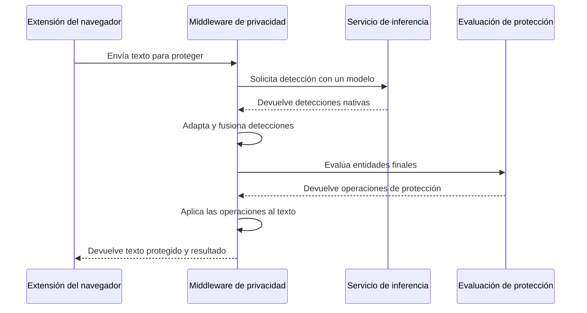

# Protección de interacciones

## Propósito

Este flujo transforma el texto de una interacción antes de que la extensión permita enviarlo a un modelo de lenguaje comercial.

## Secuencia

## Etapas

1. El middleware valida que la solicitud pueda procesarse.
2. Los mecanismos de detección habilitados analizan el mismo texto de origen.
3. El adaptador traduce las categorías nativas del modelo.
4. La fusión resuelve umbrales, duplicados y solapamientos.
5. El evaluador de reglas determina una operación para cada entidad final.
6. El motor de desidentificación aplica las operaciones sobre los fragmentos seleccionados.
7. El middleware devuelve el texto protegido y la información necesaria para que la extensión presente una revisión.

## Separación de responsabilidades

La evaluación de reglas produce decisiones, pero no modifica texto. El motor de desidentificación recibe esas decisiones y las ejecuta mediante operaciones compatibles, como:

- reemplazo por una etiqueta semántica;
- enmascaramiento parcial o total;
- generación de un seudónimo compatible;
- conservación explícita del fragmento.

Esta separación permite modificar políticas sin alterar la detección ni la mecánica de transformación.

## Restricciones

- Todas las operaciones se calculan sobre los límites del texto original.
- La transformación debe evitar que un reemplazo desplace los límites de operaciones pendientes.
- El resultado enviado a la extensión debe permitir distinguir el texto original del texto protegido.
- El middleware no envía el texto al modelo comercial.
