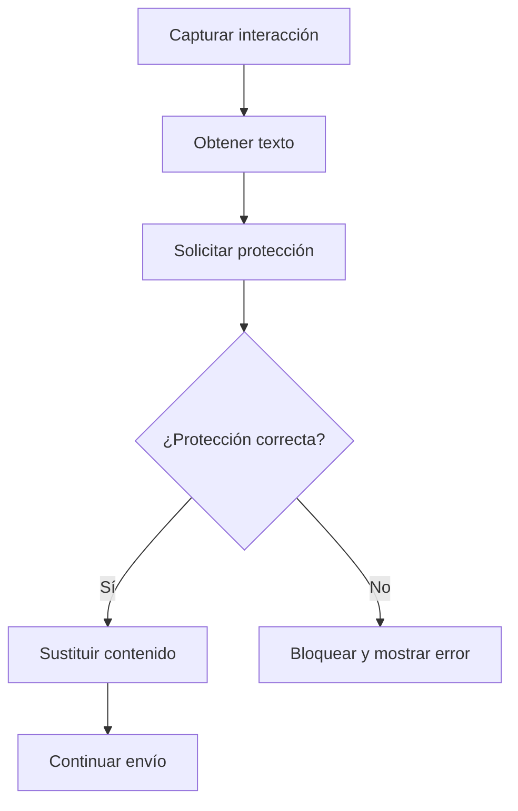

# Extensión del navegador

## Propósito técnico

La extensión es la frontera de entrada y salida entre la persona usuaria, las páginas de modelos de lenguaje comerciales y el middleware de privacidad. Coordina la protección sin implementar las reglas internas de detección o desidentificación.

## Límites

La extensión conoce cómo interactuar con cada página compatible y cómo presentar una revisión. No conoce los modelos de detección, la taxonomía, los criterios de fusión ni las reglas que producen el texto protegido.

El envío al modelo comercial ocurre desde el navegador. El middleware devuelve el resultado protegido, pero no actúa como proxy del proveedor.

## Capacidades principales

- Leer el texto del prompt.
- Leer y proteger adjuntos de texto compatibles.
- Interceptar la acción de envío antes de que el contenido abandone el navegador.
- Solicitar protección al middleware.
- Mostrar un error visible cuando la protección no puede completarse.
- Sustituir el contenido original por el contenido protegido.
- Reanudar o cancelar el envío según la decisión de la persona usuaria.

## Flujo local

## Restricciones

- El contenido no se envía al proveedor comercial antes de finalizar la protección.
- Los fallos del middleware no deben convertirse en un envío silencioso del texto original.
- Los adjuntos TXT se leen y protegen localmente antes de reinsertarse. Los PDF y documentos Office se bloquean porque la extensión no incluye todavía extractores binarios locales y nunca envía esos binarios al middleware.
- La extensión conserva la capacidad de explicar a la persona qué contenido será enviado.

## Documentación relacionada

- [`Protección de interacciones`](../../backend/privacy-middleware/flows/proteccion-de-interacciones.md): procesamiento realizado después de enviar el texto al middleware.
