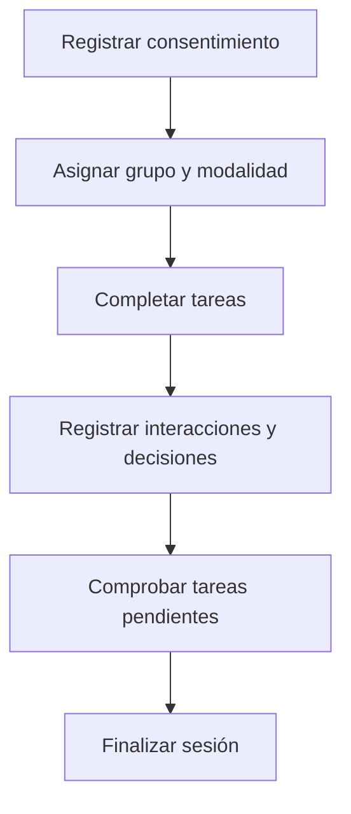

# Sesión experimental

## Objetivo

Recoger resultados comparables sobre cómo distintos grupos manejan información sensible, respetando el protocolo y las decisiones de participación.

## Participantes

- Participante
- Investigador

## Flujo principal

1. El estudio registra el consentimiento y un identificador seudónimo de la persona.
2. La sesión recibe un grupo, una modalidad y una versión del protocolo.
3. La persona completa las tareas en el orden definido.
4. Cada interacción conserva las decisiones y mediciones necesarias para el análisis.
5. La sesión finaliza cuando se completan las tareas o se registra una causa de cierre anticipado.

## Modalidades

- **Con asistencia**: el sistema analiza, advierte, propone tratamientos y registra las decisiones de revisión.
- **Sin asistencia**: la persona prepara el texto sin sugerencias; el análisis para evaluación ocurre después y no cambia su conducta durante la tarea.

## Variaciones y restricciones

- **Abandono voluntario**: la sesión se conserva como abandonada y no se mezcla automáticamente con sesiones completadas.
- **Fallo técnico**: el cierre registra esta causa para no atribuirlo a la persona.
- **Expiración**: la sesión termina cuando supera el tiempo definido por el protocolo.
- **Retiro del consentimiento**: se aplica el tratamiento de datos previsto para excluir, anonimizar o eliminar la información correspondiente.
