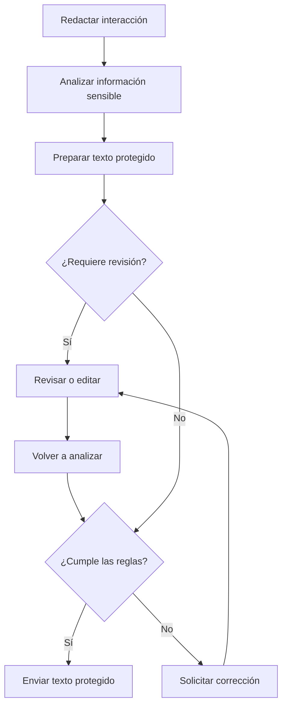

# Revisión y envío de una interacción

## Objetivo

Permitir que una persona conozca qué información será enviada, corrija el resultado cuando corresponda y continúe únicamente con un texto permitido.

## Participantes

- Persona usuaria
- Sistema de protección
- Modelo de lenguaje comercial

## Flujo principal

1. La persona redacta el prompt y selecciona los adjuntos compatibles.
2. El sistema detiene temporalmente el envío y analiza el contenido.
3. La persona recibe el texto protegido y las advertencias necesarias.
4. Puede aceptar la propuesta, editarla o rechazar cambios cuando la política lo permita.
5. Las ediciones se vuelven a analizar antes de continuar.
6. El navegador envía al modelo comercial únicamente la versión confirmada y permitida.

## Variaciones y restricciones

- **Sin detecciones relevantes**: la interacción puede continuar sin una revisión detallada.
- **Regla obligatoria incumplida**: el envío permanece bloqueado hasta corregir el contenido.
- **Fallo durante la protección**: el texto original no se envía silenciosamente.
- **Rechazo permitido**: se conserva la decisión y se informa la exposición que permanece.
- **Adjunto no compatible**: la persona debe retirarlo o proporcionar su contenido de una forma admitida.
